```python
import twitter
```


```python
ck="<>"
cs="<>"
atk="<>"
ats="<>"
api = twitter.Twitter(auth=twitter.OAuth(atk,ats,ck,cs))
```


```python
all_twitts=[]
twitts=api.statuses.user_timeline(screen_name="<username>",include_rts=True,count=200)
for i in twitts:
    all_twitts.append(i)
```


```python
from datetime import datetime
import time
def dateobj(date):
    return time.mktime(datetime.strptime(date, "%a %b %d %H:%M:%S +0000 %Y").timetuple())
```


```python
sources={}
date_source=[]
for twitt in all_twitts:
    source = twitt["source"].split(">")[1].split("<")[0]
    date_source.append([source,dateobj(twitt["created_at"])])
    try:
        sources[source.replace(" ","_")]+=1
    except:
        sources[source.replace(" ","_")]=1
print sources
```

    {u'Google': 1, u'Tweet_Old_Post': 44, u'WordPress.com': 5, u'Twitter_for_Android': 6, u'Twitter_for_Windows': 117, u'Twitter_Web_Client': 27}


```python
%matplotlib inline
import matplotlib
import numpy as np
import matplotlib.pyplot as plt
```


```python
def graph_sources(sources):
    x=range(len(sources.values()))
    y=sources.values()
    plt.bar(x,y)
    plt.xticks(x, sources.keys())
    plt.yticks(np.arange(0,max(y),10))
    plt.show()
    
graph_sources(sources)
```


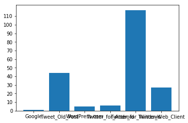


```python
#print date_source
def group_by_days(date_source):
    days={}
    for i in date_source:
        date_format = datetime.fromtimestamp(i[1]).strftime("%d-%m-%y")
        try:
            days[date_format].append(i)
        except:
            days[date_format]=[]
            days[date_format].append(i)
    return days
days = group_by_days(date_source)

```


```python
def normalice(array):
    dic={}
    for i in array:
        dic[i]=0
    nuevo_array=[]
    leyenda={}
    for i in array:
        nuevo_array.append(list(dic.keys()).index(i)+1)
        leyenda[i]=list(dic.keys()).index(i)+1
    return nuevo_array, leyenda
```


```python
for i in days.keys():
    values = days[i]
    date = int(time.mktime(datetime.strptime(i, "%d-%m-%y").timetuple()))
    x_l=np.arange(date,date+86400,3600)
    x = [p[1] for p in values]
    #x = [float(datetime.fromtimestamp(p[1]).strftime("%H")) for p in values]
    y = [u[0] for u in values]
    y, leyenda = normalice(y)
    plt.title("Fecha: " + i)
    plt.yticks(leyenda.values(),leyenda.keys())
    plt.xticks(list(x_l), ("00:00","01:00","02:00","03:00","04:00","05:00","06:00","07:00","08:00","09:00","10:00","11:00","12:00","13:00","14:00","15:00","16:00","17:00","18:00","19:00","20:00","21:00","23:00"))
#    plt.xticks((0,1,2,3,4,5,6,7,8,9,10,11,12,13,14,15,16,17,18,19,20,21,22,23), ("00:00","01:00","02:00","03:00","04:00","05:00","06:00","07:00","08:00","09:00","10:00","11:00","12:00","13:00","14:00","15:00","16:00","17:00","18:00","19:00","20:00","21:00","23:00"))
#    print list([datetime.fromtimestamp(k).strftime("%H:%M") for k in x_l])
#    print x_l
    plt.autoscale(tight=True)
    plt.scatter(x,y)
    plt.show()
```


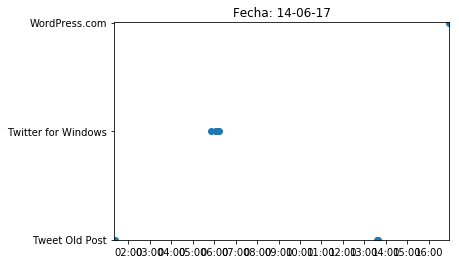


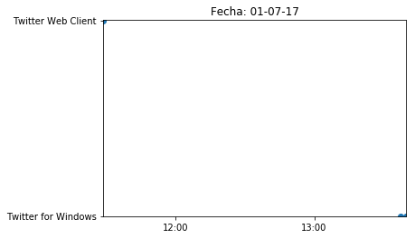


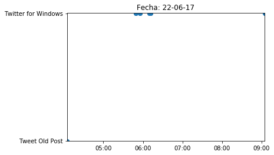


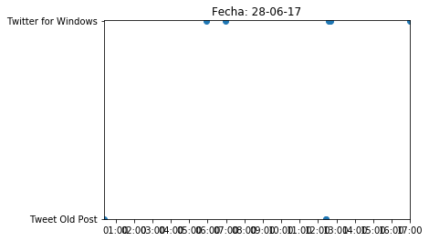


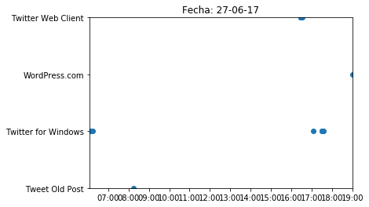


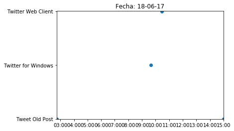


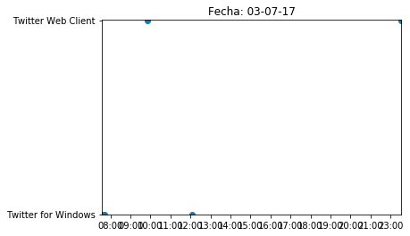


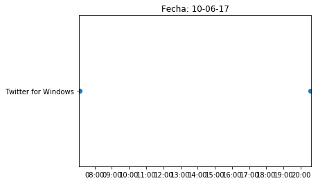


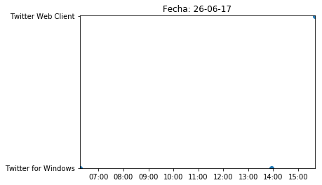


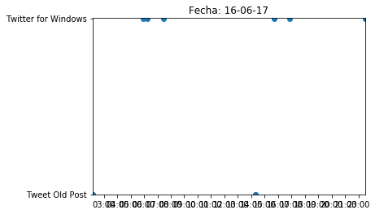


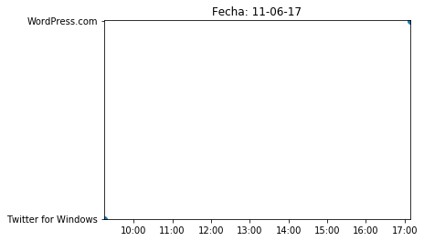


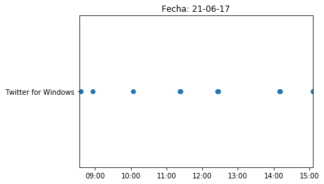


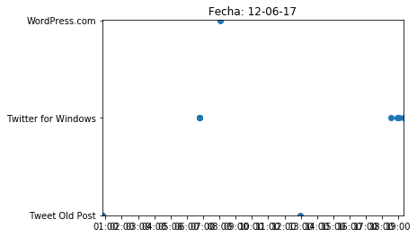


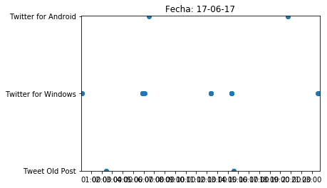


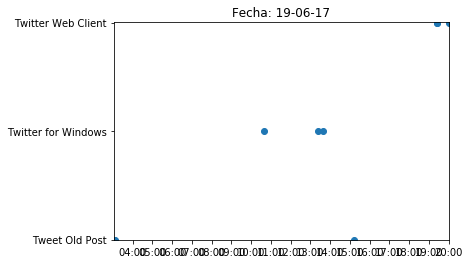


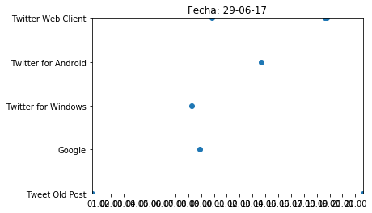


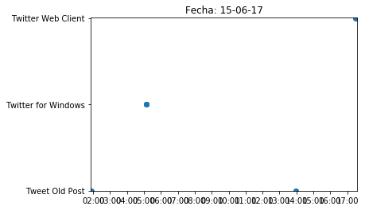


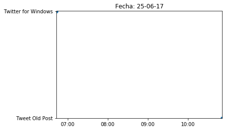


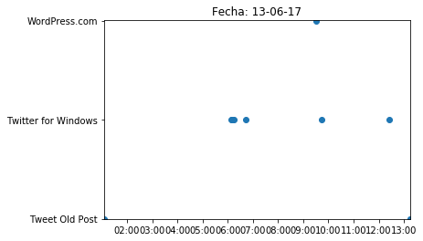


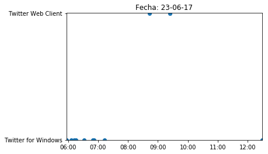


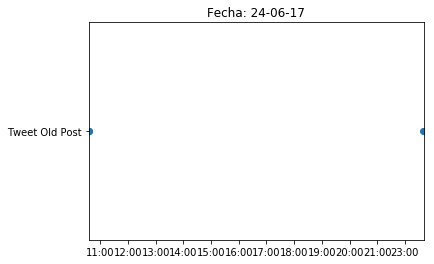


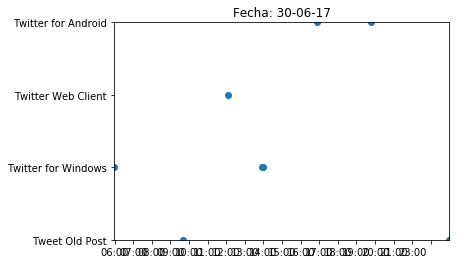

